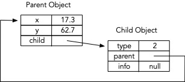

# A Lisp Dialect for Data Interchange
W F Clocksin, July 2024  (william.clocksin@cantab.net)


##Introduction
This note describes a minimal dialect of Lisp, called DILisp[^1], that is used as a data interchange language similar to JSON.  DILisp code can be more compact than JSON, and is easier to parse and generate. A parser, generator and evaluator for DILisp are implemented in Java. The DILisp syntax has several features, implemented as what Lisp calls *special forms*, to facilitate the efficient serialisation of cyclic object graphs in Java programs.

The DILisp *parser* reads a sequence of characters (from a Java string or file) and returns a DILisp expression.  The DILisp *evaluator* takes a DILisp expression and returns a Java object. The DILisp *generator* takes a Java object and returns a human-readable Java String being a sequence of characters which, if parsed, would return an equal but distinct Java object. The generator can produce strings in both a compressed format and in a 'pretty' format with indentations for improved readability.

##Syntax
DILisp code is built up from two basic elements: *atoms* and *lists*.  Atoms are used to represents names and values.  Lists are used to represent arbitrarily complex data structures.

###Atoms
An atom is a sequence of contiguous characters, or a sequence of any characters enclosed in double quote marks. There are two kinds of atoms: *Symbols* and *numbers*.  Numbers can be integers or floating point numbers.  Here are some examples of atoms:

```
hello-from-me
Boolean
a123
123
3.14159
6.63e-34
"With a \n and a \u23F0"
```

###Symbols
Symbols are used to represent names and values. The characters in an unquoted symbol must begin with a non-digit and cannot contain a whitespace character or a parenthesis.  Unlike JSON, there is no need to quote symbols unless the symbol contains non-symbol or special characters. For example, `sequence` is a symbol, and `"sequence"` is an identical symbol that has been unnecessarily quoted.  Both evaluate to an instance of Java `String`.  The characters `a1234` represent a symbol, but while `1234` is a number (evaluating to a Java `Integer`), the characters `"1234"` are a symbol that evaluates to a Java `String`.

Symbols that look like numbers but are really symbols are useful in several domains such as guitar chord notation, where `"320001"` is a DILisp symbol representing a G7 chord. This is important because if the guitar E chord notated `022100` were not quoted, it would be evaluated to the number 22,100 instead of the symbol `022100`.  Symbols may contain the usual Java string escape symbols using the backslash notation.

The symbols `true`, `false`, and `null` have special meanings when evaluated. `true` and `false` evaluate to the Java Booleans `true` and `false` respectively, and `null` evaluates to the Java Object `null`.  DILisp does not use the standard Lisp `t` and `nil`.

Some dialects of Lisp have a separate string type, which is written as a sequence of any characters enclosed in double quote marks.  However, DILisp does not have a separate type for strings, but instead, symbols may be a sequence of any characters enclosed in double quote marks. The reason for Lisp having a separate string type is because Lisp strings are not pointer equal for implementation efficiency, whereas atoms are internalised to be pointer equal. Also, Lisp strings do not need to extra features of Lisp symbols such as property lists. This is not a relevant distinction in DILisp, where all atoms can be considered as if they were pointer equal even though they are not internalised.

### Numbers
The DILisp parser accepts integers and floating point numbers. Integers are evaluated to instances of Java `Integer`, and floating-point numbers are evaluated to instances of Java `Double`.

### Lists
A list is a sequence of atoms or other lists enclosed in parentheses.  Here are some examples of lists:

```
(this is a list)
(Sunday Monday Tuesday Wednesday)
(map
	(filename ukulele.lisp)
	(midi 24)
	(boxwidth 4)
	(boxheight 4)
	(frets 15)
	(reentrant true)
	(tuning (list G4 C4 E4 A4)))
)

```
The third example shows use of the `map` and `list` special forms, described below. The map of name/value pairs describes the ukulele, a stringed musical instrument, and the list of symbols describes the pitch of the ukulele's strings.  The details are not important, but the example shows how the file name can contain a dot without the need for quoting the name, and also how whitespace may be used to clarify the structure.

##Special Forms
Lisp has the idea of a *special form*, which is a Lisp expression that is evaluated in a way meaningful to a particular purpose.  DILisp defines four special forms. Two of these, `map` and `list`, are defined to represent the two data structures analogous to the JSON object and array. When these special forms are evaluated by the DILisp evaluator, corresponding Java objects are returned.

The two other special forms, `@id` and `@ref`, are used to notate cyclic object graphs. When a data interchange language is used to represent a cyclic object graph, it is necessary to have a syntax for representing an *identifier* (a unique identifier of a given data structure), and a *reference* to an identifier.  Some -- but not all -- implementations of JSON allow for the representation of cyclic object graphs, but in the cases where DILisp was designed, it is considered essential to represent cyclic object graphs. The DILisp parser and generator parse and generate `@id` and `@ref` forms where necessary. There is no need for the user to know about `@id` and `@ref`, but `@id` and `@ref` may be seen in generated DILisp code.  The DILisp Archiver (serialiser and deserialiser) resolves references when the cyclic object graph is created.


### `map`

A map is a collection of name/value pairs, for example

~~~
(map (name-1 value-1) (name-2 value-2) ... (name-n value-n))
~~~

A `map` is evaluated to a Java `LinkedHashMap<String,Object>`. The linked hash map is used so that the order of name/value pairs is preserved on parsing and generating.  This is useful when, for example, a map is used to represent items in a human-readable preferences file, and it is desirable to preserve the order of preferences on the file for convenience of reading. A small example of a human-readable preferences file in DILisp might look like this:

```
(map
	(fontFamily Academico)
	(fontStyle Regular)
	(fontSize 14)
	(leftMargin 2.5)
	(rightMargin 2.5)
	(topMargin 2.0)
	(bottomMargin 2.0)
	(lineThickness 0.10)
)
```

### `list`

A list is an ordered list of values, for example

~~~
(list (value-1 value-2 ... value-n))
~~~

A `list` is evaluated to a Java `ArrayList<Object>`.  The example

```
(tuning (list E2 A2 D3 G3 B3 E4)))
```
shows how a name/value pair with name `tuning` represents a list of six symbols indicating musical pitches of the strings of a guitar.

### `@id`

An identifier is a list of two atoms: The symbol `@id` and a unique identifying symbol, as shown in this example:

```
(@id g432)
```
Suppose an object is referenced multiple times within a cyclic object graph. When the DILisp system generates a DILisp expression from the object graph, its first occurrence is tagged with a unique symbol. This facilitates referencing the same object in subsequent occurrences of the object without redundancy.  In a map, for example, the identifier can be (but doesn't have to be) the first name/value pair of the map; In a list, the identifier can be (but doesn't have to be) the first element of the list. The DILisp generator emits these identifiers into the generated expression automatically. 


### `@ref`

A reference is a list of two atoms: The symbol `@ref` and an integer value, as shown in this example:

```
(@ref g5)
```
Subsequent references to an object initially tagged with an `@id` are marked with `@ref` and the same identifier number. This approach greatly reduces the size of DILisp expressions because the object is serialised only once, and subsequent references to the object are handled through `@ref`. The DILisp generator emits these references into the generated expression automatically, and the DILisp Archiver causes the references to be resolved automatically. Simply calling eval does not resolve references, but it just returns the map that associates the reference with the identifier number.

###Example of @id and @ref

The simplest example of a cyclic object graph is where a child object has a *back pointer* to a parent object.  An example may be depicted as follows, where each object is a map of name-value pairs:

]

<style>
.img-container {text-align: center;}
</style>

<div class="img-container"> 

</div>

In the following code, ```(@id g0)``` identifies the parent object, and ```(@id g1)``` identifies the child object.

```
(map
  (@id g0)
  (x 17.3)
  (y 62.7)
  (child
    (map
      (@id g1)
      (type 2)
      (parent (@ref g0))
      (info null)
     )
   )
 )
```
In this example, where the child object is coded as nested within the parent object, there is no need for `(@id g1)`, as the child object is not otherwise referenced. However, the diLisp archiver emits a ```@id``` for each object in case it is referenced. The archiver also nests the first occurrence of an object within the object that references it as shown in this example.

It is important to remember that the user does not need to know about ```@id``` and ```@ref```.  These special forms are emitted automatically by the generator when a cyclic object graph is archived, and are processed when an archived object is parsed.

##Internal Representation
The internal representation of a DILisp expression corresponds exactly to a Lisp expression, with list cells composed of `car` and `cdr` components.  DILisp defines the Java object `Cell` as follows:

```java
class Cell
{
  Object car;
  Object cdr;
    ...
}
```
This lower-level scheme can be more efficient than, for example, using Java Lists to represent Lisp lists as some Java Lisp systems do.

Symbols are represented by Java Strings, and Numbers are represented by Java Integers or Doubles depending on type. The Java Object null represents the Lisp nil value.

Type dispatch using Java `instanceof` is needed internally to distinguish between the types of objects that have been evaluated. Using `instanceof` is an acceptable technique in the context here of low-level metaprogramming because Java does not support a storage-sharing union type system.

##Java API

There is a Java API for accessing the DILisp parser, evaluator, and generator.

There is also a Java API implemented as the class Archiving for using DILisp as a data interchange format for serialising and deserialising Java cyclic object graphs, and for reading and writing the files used for storing properties or preferences.  Generally property and preference files are acyclic. The Archiving API also includes methods for encoding and decoding the relevant parts of JavaFX objects such as Color, Font, TextArea and TextField so it is not necessary to archive the entire JavaFX Node structure.

In the author's application program (a music notation editor), the API is used for serialising/deserialising of documents that are cyclic object graphs, implementing property/preference files, and implementing copy/paste for editing documents.


[^1]: No relation to other uses of the word DILisp such as the DILISP Driver-In-the-Loop Intelligent Simulation Platform and the DiLisp Customer Support and Management System.
